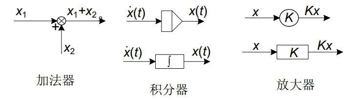

现代控制理论——02 控制系统的状态空间描述

<!-- more -->

# 控制系统的状态空间描述

## 基本概念

### 系统的状态空间模型

1. 线性时变系统的状态空间模型：系数矩阵与时间无关。

$$\left\{ \begin{matrix} \dot{x}=Ax+Bu\\y=Cx+Du\\\end{matrix}\right.   \tag{1}$$

其中，$u=R^r$为输入向量；$y=R^m$为输出向量；$x\in R^n$为状态向量。$A,B,C,D$为系数矩阵。

2. 线性时不变系统的状态空间模型：系数矩阵与时间有关。

$$\left\{ \begin{matrix} \dot{x}=A(t)x+B(t)u\\y=C(t)x+D(t)u\\\end{matrix}\right.   \tag{2}$$

3. 离散线性系统的状态空间模型。

$$\left\{ \begin{matrix} x(k+1)=A(k)x(k)+B(k)u(k)\\y(k)=C(k)x(k)+D(k)u(k)\\\end{matrix}\right.   \tag{3}$$

### 状态空间描述的特点

1. 系统的状态变量的个数=系统中包含的独立储能元件的个数=系统的阶数。
2. 在给定的系统中，状态变量的选择不唯一，但是状态变量的个数是一致的。
3. 基于状态变量选取的不同，同一系统可以用不同的动态方程来描述。

+++primary 证明

对于一个状态方程$\left\{ \begin{matrix} \dot{x}=Ax+Bu\\y=Cx\\\end{matrix}\right.$，选择非奇异矩阵$P\in R^{n\times n}$作为变换阵，有$x=P\overline{x}$，那么此时状态方程可表示为：

$$\dot{\overline{x}}=P^{-1}\dot{x}=P^{-1}[Ax+Bu]=P^{-1}AP\overline{x}+P^{-1}Bu=\overline{A}\overline{x}+\overline{B}u   \tag{4}$$

$$y=Cx=CP\overline{x}=\overline{C}\overline{x}    \tag{5}$$

其中，$\overline{A}=P^{-1}AP,\overline{B}=P^{-1}B,\overline{C}=CP$。

因此当状态变量 $x$ 改变时，一定存在变换矩阵 $P$ 使得状态方程发生变化。

+++

### 状态空间模型的建立步骤

1. 选择状态变量。
2. 根据物体或其他机理列写微分方程。
3. 转化为矩阵形式，得到状态空间模型。

### 状态空间表达式的系统方框图

公式（1）是线性时不变系统状态空间表达式的一般形式。其系统方框图可表示如下：

### 状态空间表达式的状态变量图

1. 状态变量图的基本元素符号

2. 绘制步骤

- **绘制积分器**  积分器数量等于状态变量数目。
- **由状态方程和输出方程绘制加法器和放大器**
- **连接各元件**

+++info 例题

;;;id1 例题1

:::info 

设有三阶系统状态空间表达式如下，试绘制其状态变量图。

$$\left\{ \begin{aligned}\begin{matrix} \dot{x}_1=x_2\\\dot{x}_2=x_3\\\dot{x}_3=-6x_1-3x_2-2x_3+u\\y=x_1+x_2\end{matrix}\end{aligned}\right.$$

:::

其状态变量图可绘制如下：

;;;

+++

## 传递函数和传递函数矩阵

### 单输入单输出系统

对于单输入单输出系统$\left\{ \begin{matrix} \dot{x}=Ax+Bu\\y=Cx+Du\\\end{matrix}\right.$，在零初始条件下其传递函数可表示为：

$$g(s)=\frac{Y(s)}{U(s)}=C(sI-A)^{-1}B+D    \tag{6}$$

+++primary 推导

在系统$\left\{ \begin{matrix} \dot{x}=Ax+Bu\\y=Cx+Du\\\end{matrix}\right.$ 中，在零初始条件下取拉氏变换有：$\left\{ \begin{matrix} sX(s)=AX(s)+BU(s)\\Y(s)=CX(s)+DU(s)\\\end{matrix}\right.$，整理得到$\left\{ \begin{matrix} X(s)=(sI-A)^{-1}BU(s)\\Y(s)=C(sI-A)^{-1}BU(s)+DU(s)\\\end{matrix}\right.$，故$g(s)=\frac{Y(s)}{U(s)}=C(sI-A)^{-1}B+D$

+++

在 $D=0$ 时，$g(s)=\frac{Y(s)}{U(s)}=C(sI-A)^{-1}B=\frac{Cadj(sI-A)B}{|sI-A|}$，其中$adj(sI-A)$表示矩阵$sI-A$的伴随矩阵。

对比自控原理中传递函数的表达式：$g(s)=\frac{b_0s^n+b_1s^{n-1}+\cdots +b_{n-1}s+b_n}{s^n+a_1s^{n-1}+\cdots +a_{n-1}s+a_n}$，可知：

1. 系统矩阵$A$的特征多项式等同于传递函数的分母多项式。
2. 传递函数的极点就是系统矩阵$A$的特征值。
3. **传递函数的不变性**  同一系统的状态空间描述不唯一，但传递函数是唯一的。

+++primary 证明：同一系统的不同状态空间描述具有相同的特征值。

对于同一系统，选择两个不同的状态向量 $x\in{R^n}$ 和 $\overline{x}\in{R^n}$ 分别得到不同的状态空间描述：

$$\begin{matrix}\left\{ \begin{matrix} \dot{x}=Ax+Bu\\y=Cx+Du\\\end{matrix}\right.&&&\left\{ \begin{matrix} \dot{\overline{x}}=\overline{A}\overline{x}+\overline{B}u\\y=\overline{C}\overline{x}+\overline{D}u\\\end{matrix}\right.\end{matrix}$$

两种状态变量一定存在着可逆变化关系：$x=P\overline{x}$，故：

$$\left\{ \begin{matrix} \dot{x}=Ax+Bu\\y=Cx+Du\\\end{matrix}\right.\Rightarrow \left\{ \begin{matrix} P\dot{\overline{x}}=AP\overline{x}+Bu\\y=CP\overline{x}+Du\\\end{matrix}\right.\Rightarrow \left\{ \begin{matrix} \dot{\overline{x}}=P^{-1}AP\overline{x}+P^{-1}Bu\\y=CP\overline{x}+Du\\\end{matrix}\right.$$

故 $\overline{A}=P^{-1}AP$，所以矩阵 $A$ 与矩阵 $\overline{A}$ 相似，故特征值相同。

:::info

相似矩阵具体相同的特征值

:::

+++

### 多输入多输出系统

对于多输入多输出系统，输入向量$u=[u_1\cdots u_p]^T$，输出向量$y=[y_1\dots y_q]^T$。我们把第$i$个输出$y_i$和第$j$个输入$u_j$间的传递函数定义为：$g_{ij}(s)=\frac{Y_i(s)}{U_j(s)}$。故系统的输入输出关系可表示为：

$$\begin{bmatrix}Y_1(s)\\Y_2(s)\\\vdots\\Y_q(s)\end{bmatrix}=\begin{bmatrix}g_{11}(s)&g_{12}(s)&\cdots&g_{1p}(s)\\g_{21}(s)&g_{22}(s)&\cdots&g_{2p}(s)\\\vdots&\vdots&\ddots&\vdots\\g_{q1}(s)&g_{q2}(s)&\cdots&g_{qp}(s)\end{bmatrix}\begin{bmatrix}U_1(s)\\U_2(s)\\\vdots\\U_q(s)\end{bmatrix}$$

以矩阵的形式表示：$Y(s)=G(s)U(s)$，其中 $G(s)$称为传递函数矩阵。

对于多输入多输出系统$\left\{ \begin{matrix} \dot{x}=Ax+Bu\\y=Cx+Du\\\end{matrix}\right.$，同样传递函数矩阵为：

$$G(s)=C(sI-A)^{-1}B+D=\frac{Cadj(sI-A)B+D|sI-A|}{|sI-A|}$$

+++info 例题

;;;id2 例题1

:::info 

已知系统动态方程为$\begin{bmatrix}\dot{x_1}\\\dot{x_2}\end{bmatrix}=\begin{bmatrix}0&1\\0&-2\end{bmatrix}\begin{bmatrix}x_1\\x_2\end{bmatrix}+\begin{bmatrix}1&0\\0&1\end{bmatrix}\begin{bmatrix}u_1\\u_2\end{bmatrix}$，$\begin{bmatrix}y_1\\y_2\end{bmatrix}=\begin{bmatrix}1&0\\0&1\end{bmatrix}\begin{bmatrix}x_1\\x_2\end{bmatrix}$，试求系统的传递函数矩阵。

:::

由题，$G(s)=C(sI-A)^{-1}B+D=\begin{bmatrix}1&0\\0&1\end{bmatrix}\begin{bmatrix}\frac{1}{s}&\frac{1}{s(s+2)}\\0&\frac{1}{s+2}\end{bmatrix}\begin{bmatrix}1&0\\0&1\end{bmatrix}=\begin{bmatrix}\frac{1}{s}&\frac{1}{s(s+2)}\\0&\frac{1}{s+2}\end{bmatrix}$。

;;;

+++

