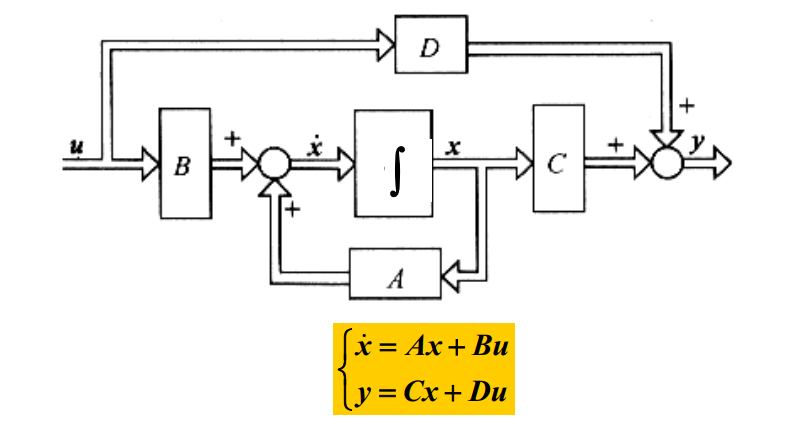
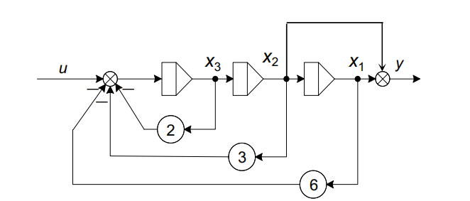

现代控制理论——02 控制系统的状态空间描述

<!-- more -->

# 控制系统的状态空间描述

## 基本概念

### 系统的状态空间模型

1. 线性时变系统的状态空间模型：系数矩阵与时间无关。

$$\left\{ \begin{matrix} \dot{x}=Ax+Bu\\y=Cx+Du\\\end{matrix}\right.   \tag{1}$$

其中，$u=R^r$为输入向量；$y=R^m$为输出向量；$x\in R^n$为状态向量。$A,B,C,D$为系数矩阵。

2. 线性时不变系统的状态空间模型：系数矩阵与时间有关。

$$\left\{ \begin{matrix} \dot{x}=A(t)x+B(t)u\\y=C(t)x+D(t)u\\\end{matrix}\right.   \tag{2}$$

3. 离散线性系统的状态空间模型。

$$\left\{ \begin{matrix} x(k+1)=A(k)x(k)+B(k)u(k)\\y(k)=C(k)x(k)+D(k)u(k)\\\end{matrix}\right.   \tag{3}$$

### 状态空间描述的特点

1. 系统的状态变量的个数=系统中包含的独立储能元件的个数=系统的阶数。
2. 在给定的系统中，状态变量的选择不唯一，但是状态变量的个数是一致的。
3. 基于状态变量选取的不同，同一系统可以用不同的动态方程来描述。

+++primary 证明

对于一个状态方程$\left\{ \begin{matrix} \dot{x}=Ax+Bu\\y=Cx\\\end{matrix}\right.$，选择非奇异矩阵$P\in R^{n\times n}$作为变换阵，有$x=P\overline{x}$，那么此时状态方程可表示为：

$$\dot{\overline{x}}=P^{-1}\dot{x}=P^{-1}[Ax+Bu]=P^{-1}AP\overline{x}+P^{-1}Bu=\overline{A}\overline{x}+\overline{B}u   \tag{4}$$

$$y=Cx=CP\overline{x}=\overline{C}\overline{x}    \tag{5}$$

其中，$\overline{A}=P^{-1}AP,\overline{B}=P^{-1}B,\overline{C}=CP$。

因此当状态变量 $x$ 改变时，一定存在变换矩阵 $P$ 使得状态方程发生变化。

+++

### 状态空间模型的建立步骤

1. 选择状态变量。
2. 根据物体或其他机理列写微分方程。
3. 转化为矩阵形式，得到状态空间模型。

### 状态空间表达式的系统方框图

公式（1）是线性时不变系统状态空间表达式的一般形式。其系统方框图可表示如下：

### 状态空间表达式的状态变量图

1. 状态变量图的基本元素符号

2. 绘制步骤

- **绘制积分器**  积分器数量等于状态变量数目。
- **由状态方程和输出方程绘制加法器和放大器**
- **连接各元件**

+++info 例题

;;;id1 例题1

:::info no-icon

设有三阶系统状态空间表达式如下，试绘制其状态变量图。

$$\left\{ \begin{aligned}\begin{matrix} \dot{x}_1=x_2\\\dot{x}_2=x_3\\\dot{x}_3=-6x_1-3x_2-2x_3+u\\y=x_1+x_2\end{matrix}\end{aligned}\right.$$

:::

其状态变量图可绘制如下：

;;;

+++

## 传递函数和传递函数矩阵

### 单输入单输出系统

对于单输入单输出系统$\left\{ \begin{matrix} \dot{x}=Ax+Bu\\y=Cx+Du\\\end{matrix}\right.$，在零初始条件下其传递函数可表示为：

$$g(s)=\frac{Y(s)}{U(s)}=C(sI-A)^{-1}B+D    \tag{6}$$

+++primary 推导

在系统$\left\{ \begin{matrix} \dot{x}=Ax+Bu\\y=Cx+Du\\\end{matrix}\right.$ 中，在零初始条件下取拉氏变换有：$\left\{ \begin{matrix} sX(s)=AX(s)+BU(s)\\Y(s)=CX(s)+DU(s)\\\end{matrix}\right.$，整理得到$\left\{ \begin{matrix} X(s)=(sI-A)^{-1}BU(s)\\Y(s)=C(sI-A)^{-1}BU(s)+DU(s)\\\end{matrix}\right.$，故$g(s)=\frac{Y(s)}{U(s)}=C(sI-A)^{-1}B+D$

+++

在 $D=0$ 时，$g(s)=\frac{Y(s)}{U(s)}=C(sI-A)^{-1}B=\frac{Cadj(sI-A)B}{|sI-A|}$，其中$adj(sI-A)$表示矩阵$sI-A$的伴随矩阵。

对比自控原理中传递函数的表达式：$g(s)=\frac{b_0s^n+b_1s^{n-1}+\cdots +b_{n-1}s+b_n}{s^n+a_1s^{n-1}+\cdots +a_{n-1}s+a_n}$，可知：

1. 系统矩阵$A$的特征多项式等同于传递函数的分母多项式。
2. 传递函数的极点就是系统矩阵$A$的特征值。
3. **传递函数的不变性**  同一系统的状态空间描述不唯一，但传递函数是唯一的。

+++primary 证明：同一系统的不同状态空间描述具有相同的特征值。

对于同一系统，选择两个不同的状态向量 $x\in{R^n}$ 和 $\overline{x}\in{R^n}$ 分别得到不同的状态空间描述：

$$\begin{matrix}\left\{ \begin{matrix} \dot{x}=Ax+Bu\\y=Cx+Du\\\end{matrix}\right.&&&\left\{ \begin{matrix} \dot{\overline{x}}=\overline{A}\overline{x}+\overline{B}u\\y=\overline{C}\overline{x}+\overline{D}u\\\end{matrix}\right.\end{matrix}$$

两种状态变量一定存在着可逆变化关系：$x=P\overline{x}$，故：

$$\left\{ \begin{matrix} \dot{x}=Ax+Bu\\y=Cx+Du\\\end{matrix}\right.\Rightarrow \left\{ \begin{matrix} P\dot{\overline{x}}=AP\overline{x}+Bu\\y=CP\overline{x}+Du\\\end{matrix}\right.\Rightarrow \left\{ \begin{matrix} \dot{\overline{x}}=P^{-1}AP\overline{x}+P^{-1}Bu\\y=CP\overline{x}+Du\\\end{matrix}\right.$$

故 $\overline{A}=P^{-1}AP$，所以矩阵 $A$ 与矩阵 $\overline{A}$ 相似，故特征值相同。

:::info

相似矩阵具体相同的特征值

:::

+++

### 多输入多输出系统

对于多输入多输出系统，输入向量$u=[u_1\cdots u_p]^T$，输出向量$y=[y_1\dots y_q]^T$。我们把第$i$个输出$y_i$和第$j$个输入$u_j$间的传递函数定义为：$g_{ij}(s)=\frac{Y_i(s)}{U_j(s)}$。故系统的输入输出关系可表示为：

$$\begin{bmatrix}Y_1(s)\\Y_2(s)\\\vdots\\Y_q(s)\end{bmatrix}=\begin{bmatrix}g_{11}(s)&g_{12}(s)&\cdots&g_{1p}(s)\\g_{21}(s)&g_{22}(s)&\cdots&g_{2p}(s)\\\vdots&\vdots&\ddots&\vdots\\g_{q1}(s)&g_{q2}(s)&\cdots&g_{qp}(s)\end{bmatrix}\begin{bmatrix}U_1(s)\\U_2(s)\\\vdots\\U_q(s)\end{bmatrix}$$

以矩阵的形式表示：$Y(s)=G(s)U(s)$，其中 $G(s)$称为传递函数矩阵。

对于多输入多输出系统$\left\{ \begin{matrix} \dot{x}=Ax+Bu\\y=Cx+Du\\\end{matrix}\right.$，同样传递函数矩阵为：

$$G(s)=C(sI-A)^{-1}B+D=\frac{Cadj(sI-A)B+D|sI-A|}{|sI-A|}$$

+++info 例题

;;;id2 例题1

:::info no-icon

已知系统动态方程为$\begin{bmatrix}\dot{x}_1\\\dot{x}_2\end{bmatrix}=\begin{bmatrix}0&1\\0&-2\end{bmatrix}\begin{bmatrix}x_1\\x_2\end{bmatrix}+\begin{bmatrix}1&0\\0&1\end{bmatrix}\begin{bmatrix}u_1\\u_2\end{bmatrix}$，$\begin{bmatrix}y_1\\y_2\end{bmatrix}=\begin{bmatrix}1&0\\0&1\end{bmatrix}\begin{bmatrix}x_1\\x_2\end{bmatrix}$，试求系统的传递函数矩阵。

:::

由题，$G(s)=C(sI-A)^{-1}B+D=\begin{bmatrix}1&0\\0&1\end{bmatrix}\begin{bmatrix}\frac{1}{s}&\frac{1}{s(s+2)}\\0&\frac{1}{s+2}\end{bmatrix}\begin{bmatrix}1&0\\0&1\end{bmatrix}=\begin{bmatrix}\frac{1}{s}&\frac{1}{s(s+2)}\\0&\frac{1}{s+2}\end{bmatrix}$。

;;;

+++

## 建立状态空间表达式

### 高阶微分方程化为状态空间描述

在单输入单输出线性时不变系统中，系统的输出与输入的关系可用如下高阶微分方程描述：

$$y^{(n)}+a_1y^{(n-1)}+\cdots +a_{n-1}\dot{y}+a_ny=b_0u^{(m)}+b_1u^{(m-1)}+\cdots +b_{m-1}\dot{u}+b_mu    \tag{7}$$

其中，$m\leq n$。根据微分方程右侧是否含有输入函数的导数（即$m$是否等于0）分两种情况讨论。

#### 常微分方程中不含输入函数的导数

若常微分方程中不含有输入函数的导数，即：$y^{(n)}+a_1y^{(n-1)}+\cdots +a_{n-1}\dot{y}+a_ny=b_mu$。

那么可以选取状态变量：

$$x_1=\frac{1}{b_m}y,\quad x_2=\frac{1}{b_m}\dot{y},\quad \cdots \quad  x_n=\frac{1}{b_m}y^{(n-1)}      \tag{8}$$

那么就可以得到状态方程（前$n-1$条通过求导获得，最后一条通过原微分方程获得）：

$$\left\{ \begin{matrix} \dot{x}_1=x_2\\\dot{x}_2=x_3\\\vdots\\\dot{x}_n=y^{(n)}=-a_nx_1-a_{n-1}x_2-\cdots -a_1x_n+u\end{matrix}\right.$$

输出方程为：$y=b_mx_1$。

以矩阵的形式可表示为：

$$\dot{x}=\begin{bmatrix}0&1&\cdots &0\\\vdots&\vdots&\ddots&\vdots\\0&0&\cdots&1\\-a_n&-a_{n-1}&\cdots&-a_1\end{bmatrix}x+\begin{bmatrix}0\\0\\\vdots\\1\end{bmatrix}u    \tag{9}$$

$$y=\begin{bmatrix}1&0&\cdots&0\end{bmatrix}x     \tag{10}$$

+++primary 能控标准型

形如公式（9）的状态空间模型称为能控标准型。即$A$与$b$可用以下形式表示：

$$A=\begin{bmatrix}0&1&\cdots &0\\\vdots&\vdots&\ddots&\vdots\\0&0&\cdots&1\\-a_n&-a_{n-1}&\cdots&-a_1\end{bmatrix},\quad b=\begin{bmatrix}0\\0\\\vdots\\1\end{bmatrix}$$

+++

+++info 例题

;;;id3 例题1

:::info no-icon

设系统的运动方程为：$y^{(3)}+5\ddot{y}+8\dot{y}+6y=3u$，试求其状态空间表达式。

:::

选取状态变量$x_1=y,\quad x_2=\dot{y},\quad x_3=\ddot{y}$，则有状态方程：

$$\left\{ \begin{matrix} \dot{x}_1=x_2\\\dot{x}_2=x_3\\\dot{x}_3=y^{(3)}=-6x_1-8x_2 -5x_3+3u\end{matrix}\right.$$

输出方程为$y=x_1$。

故状态空间表达式为：

$$\dot{x}=\begin{bmatrix}0&1 &0\\0&0&1\\-6&-8&-5\end{bmatrix}x+\begin{bmatrix}0\\0\\3\end{bmatrix}u $$

$$y=\begin{bmatrix}1&0&0\end{bmatrix}x$$

;;;

+++

#### 常微分方程中含有输入函数的导数

若常微分方程中含有输入函数的导数，即：$y^{(n)}+a_1y^{(n-1)}+\cdots +a_{n-1}\dot{y}+a_ny=b_0u^{(m)}+b_1u^{(m-1)}+\cdots +b_{m-1}\dot{u}+b_mu$。

选择状态变量：

$$\left\{ \begin{matrix} x_1=y-\beta_0u\\x_2=\dot{x}_1-\beta_1u=\dot{y}-\beta_0\dot{u}-\beta_1u\\x_3=\dot{x}_2-\beta_2u=\ddot{y}-\beta_0\ddot{u}-\beta_1\dot{u}-\beta_2u\\\vdots\\x_n=\dot{x}_{n-1}-\beta_{n-1}u=y^{(n)}-\beta_0u^{(n-1)}-\beta_1u^{(n-2)}-\cdots -\beta_{n-2}\dot{u}-\beta_{n-1}u\end{matrix}\right.   \tag{11}$$

其中参数$\beta_0,\beta_1,\cdots,\beta_n$由下式决定：

$$\begin{bmatrix}\beta_0\\\beta_1\\\beta_2\\\vdots\\\beta_n\end{bmatrix}=\begin{bmatrix}1&0&\cdots&0&0\\a_1&1&\cdots&0&0\\\vdots&\vdots&\ddots&\vdots&\vdots\\a_{n-1}&a_{n-2}&\cdots&1&0\\a_n&a_{n-1}&\cdots&a_1&1\end{bmatrix}\begin{bmatrix}b_0\\b_1\\b_2\\\vdots\\b_n\end{bmatrix}    \tag{12}$$

由（11）可得到状态方程：$\left\{ \begin{matrix} \dot{x}_1=x_2+\beta_1u\\\dot{x}_2=x_3+\beta_2u\\\vdots\\\dot{x}_{n-1}=x_n+\beta_{n-1}u\\\begin{aligned}\dot{x}_n&=y^{(n)}-\beta_0u^{(u)}-\beta_1u^{(n-1)}-\cdots -\beta_{n-2}\ddot{u}-\beta_{n-1}\dot{u}\\&=-a_nx_1-a_{n-1}x_2-\cdots -a_1x_n+\beta_nu\end{aligned} \end{matrix}\right.$。

+++info 最后一个等式怎么化简得到的？

+++

因此，状态空间表达式为：

$$\dot{x}=\begin{bmatrix}0&1&0&\cdots&0\\0&0&1&\cdots&0\\\vdots&\vdots&\vdots&\ddots&\vdots\\0&0&0&\cdots&1\\-a_n&-a_{n-1}&-a_{n-2}&\cdots&-a_1\end{bmatrix}x+\begin{bmatrix}\beta_0\\\beta_1\\\vdots\\\beta_{n-1}\\\beta_n\end{bmatrix}u   \tag{13}$$

$$y=[1\quad 0\quad \cdots\quad 0 ]x+\beta_0u$$

### 通过传递函数建立状态空间描述

后续的方法我们讨论的传递函数的分子多项式次数均小于分母多项式次数。因为对于实际系统，分子多项式次数总是小于或等于分母多项式次数，在次数相等时可以通过化简的方法转化为分子多项式次数小于分母多项式次数。

+++primary 推导

若传递函数的分子多项式次数等于分母多项式次数，即

$$g(s)=\frac{b_0s^m+b_1s^{m-1}+\cdots +b_{m-1}s+b_m}{s^n+a_1s^{n-1}+\cdots +a_{n-1}s+a_n},m=n$$

它总是可以化简为：

$$g(s)=\frac{b_1s^{m-1}+\cdots +b_{m-1}s+b_m}{s^n+a_1s^{n-1}+\cdots +a_{n-1}s+a_n}=\overline{g}(s)+b_0,m=n$$

其中 $\overline{g}(s)$ 为分子多项式次数小于分母多项式次数的传递函数，$b_0$ 为常数，整体视为两者的并联结构。

+++

#### 直接分解法

对于$n$阶传递函数：$g(s)=\frac{Y(s)}{U(s)}=\frac{b_1s^{n-1}+\cdots +b_{n-1}s+b_n}{s^n+a_1s^{n-1}+\cdots +a_{n-1}s+a_n}$。

同时除以$s^n$有：$Y(s)=U(s)\frac{b_1s^{-1}+\cdots +b_{n-1}s^{-(n-1)}+b_ns^{-n}}{1+a_1s^{-1}+\cdots +a_{n-1}s^{-(n-1)}+a_ns^{-n}}$。

令中间变量$E(s)=U(s)\frac{1}{1+a_1s^{-1}+\cdots +a_{n-1}s^{-(n-1)}+a_ns^{-n}}$，即$E(s)=U(s)-a_1s^{-1}E(s)-\cdots -a_{n-1}s^{-(n-1)}E(s)-a_ns^{-n}E(s)$。

则输入$U(s)$、中间变量$E(s)$和输出$Y(s)$的关系流程图如下：

则$Y(s)=b_1s^{-1}E(s)+b_2s^{-2}E(s)+\cdots +b_{n-1}s^{-(n-1)}E(s)+b_ns^{-n}E(s)$。

令$x_n,x_{n-1},\cdots,x_1$为$s^{-1}E(s),s^{-2}E(s),\cdots,s^{-n}E(s)$的拉氏逆变换，那么就可以绘制状态变量图并得到系统的状态空间表达式（能控标准型）。

$$\dot{x}=\begin{bmatrix}0&1&\cdots&0\\\vdots&\vdots&\ddots&\vdots\\0&0&\cdots&1\\-a_n&-a_{n-1}&\cdots&-a_1\end{bmatrix}x+\begin{bmatrix}0\\\vdots\\0\\1\end{bmatrix}u   \tag{14}$$

$$y=[b_n\quad b_{n-1}\quad \cdots\quad b_1 ]x$$

+++info 补充

如果该$n$阶系统传递函数的分子多项式次数等于分母多项式次数（在[通过传递函数建立状态空间描述](#通过传递函数建立状态空间描述)中讨论过该情况）即 $g(s)=\frac{b_1s^{m-1}+\cdots +b_{m-1}s+b_m}{s^n+a_1s^{n-1}+\cdots +a_{n-1}s+a_n}=\overline{g}(s)+b_0,m=n$，那么先算出 $\overline{g}(s)$ 后在输入到输出之间直接连接一个比例环节即可。

+++

#### 串联分解法

该方法适用于传递函数可分解为因式相乘的形式，即$g(s)=\frac{b_1(s-z_1)(s-z_2)\cdots(s-z_{n-1})}{(s-p_1)(s-p_2)\dots(s-p_n)}$。

以一个三阶系统进行说明：$g(s)=\frac{b_1(s-z_1)(s-z_2)}{(s-p_1)(s-p_2)(s-p_3)}$。

上式中可分为两种：$\frac{1}{s-p}=\frac{\frac{1}{s}}{1-\frac{1}{s}p}$，$\frac{s-z}{s-p}=1+\frac{p-z}{s-p}=1+(p-z)\frac{\frac{1}{s}}{1-\frac{1}{s}p}$。

因此系统可视为三个一阶系统串联而成，结构图如下：

取每个积分器的输出为状态变量，那么可以得到状态空间表达式如下：

$$\left\{ \begin{matrix} \dot{x}_1=p_1x_1+b_1u\\\dot{x}_2=x_1+p_2x_2\\\dot{x}_3=x_1+(p_2-z_2)x_2+p_3x_3\\y=x_1+(p_2-z_2)x_2+(p_3-z_3)x_3\end{matrix}\right.$$

写成向量的形式为：

$$\dot{x}=\begin{bmatrix}p_1&0&0\\1&p_2&0\\1&p_2-z_2&p_3\end{bmatrix}x+\begin{bmatrix}b_1\\0\\0\end{bmatrix}u   \tag{15}$$

$$y=[1\quad p_2-z_2\quad \quad p_3-z_3 ]x$$

#### 并联分解法

1. 若传递函数的极点两两相异。

传递函数极点两两相异，则$g(s)=\frac{N(s)}{(s-p_1)(s-p_2)\dots(s-p_n)}=\frac{c_1}{s-p_1}+\frac{c_2}{s-p_2}+\cdots+\frac{c_n}{s-p_n}$，其中$c_i=\lim_{s\to p_i}(s-p_i)g(s)$。

选取状态变量 $x_i(s)=\frac{1}{s-p_i}U(s)$，即 $sx_i(s)=p_ix_i(s)+u(s)$，做拉氏逆变换有：

$$\dot{x}_i(t)=p_ix_i(t)+u(t)$$

输出 $y(s)=g(s)u(s)=\sum_{i=1}^n\frac{c_i}{s-p_i}u_i(s)=\sum_{i=1}^nc_ix_i(s)$，做拉氏逆变换有：

$$y(t)=\sum_{i=1}^nc_ix_i(t)$$

写成向量的形式为：

$$\dot{x}=\begin{bmatrix}p_1&0&\cdots&0\\0&p_2&\cdots&0\\\vdots&\vdots&\ddots&0\\0&0&\cdots&p_n\end{bmatrix}x+\begin{bmatrix}1\\1\\\vdots\\1\end{bmatrix}u   \tag{16}$$

$$y=[c_1\quad c_2\quad\cdots \quad c_n]x$$

+++info 上式为对角标准型

对于系统 $\left\{ \begin{matrix} \dot{x}=Ax+Bu\\y=Cx\\\end{matrix}\right.$ ，若$A$为对角阵且各元素为传递函数的极点，$B$为全1矩阵，$C$内各元素为对应极点的留数，那么称该矩阵表达式为对角标准型。

+++

2. 若传递函数具有重极点。

先考虑只有一个重极点和若干个单极点，重数为$r$，$g(s)=\frac{c_{11}}{(s-p_1)^{r}}+\frac{c_{12}}{(s-p_1)^{r-1}}+\cdots+\frac{c_{1r}}{(s-p_1)^{}}+\frac{c_{r+1}}{s-p_{r+1}}+\cdots+\frac{c_n}{s-p_n}$，其中对于单极点仍有：$c_i=\lim_{s\to p_i}(s-p_i)g(s)$，而对于重极点则有：$c_1j=\frac{1}{(j-1)!}\lim_{s\to p_1}\frac{d^{j-1}}{ds^{j-1}}[(s-p_1)g(s)],\quad j=1,2,\cdots,r$。

选取状态变量，化简求拉氏逆变换得到状态方程：

$$\begin{matrix}\left\{ \begin{matrix} x_1(s)=\frac{U(s)}{(s-p_1)^{r}}\\x_2(s)=\frac{U(s)}{(s-p_1)^{r-1}}\\\vdots\\x_r(s)=\frac{U(s)}{(s-p_1)}\\x_{r+1}(s)=\frac{U(s)}{s-p_{r+1}}\\\vdots\\x_{1}(s)=\frac{U(s)}{s-p_{n}}\end{matrix}\right.\quad\stackrel{}{\Rightarrow}\quad\left\{ \begin{matrix} x_1(s)=\frac{1}{s-p_1}x_2(s)\\x_2(s)=\frac{1}{s-p_1}x_3(s)\\\vdots\\x_r(s)=\frac{1}{s-p_1}U(s)\\x_{r+1}(s)=\frac{1}{s-p_{r+1}}U(s)\\\vdots\\x_n(s)=\frac{1}{s-p_n}U(s)\end{matrix}\right.\quad\stackrel{L^{-1}}{\Rightarrow}\quad \left\{ \begin{matrix} \dot{x}_1(t)=p_1x_1+x_2\\\dot{x}_2(t)=p_1x_2+x_3\\\vdots\\\dot{x}_r(t)=p_1x_r+u\\\dot{x}_{r+1}(t)=p_{r+1}x_{x+1}+u\\\vdots\\\dot{x}_n(t)=p_nx_n+u\end{matrix}\right.     \end{matrix}$$

输出方程的拉氏变换为：

$$Y(s)=c_{11}x_1(s)+c_{12}x_2(s)+\cdots+c_{1r}x_r(s)+c_{r+1}x_{r+1}(s)+\cdots+c_{nx_n(s)}$$

求拉氏逆变换有：

$$y(t)=c_{11}x_1(t)+c_{12}x_2(t)+\cdots+c_{1r}x_r(t)+c_{r+1}x_{r+1}(t)+\cdots+c_{nx_n(t)}$$

得到状态空间表达式为：

$$\begin{bmatrix}\dot{x_1}\\\dot{x_2}\\\vdots\\\dot{x_r}\\\dot{x_{r+1}}\\\vdots\\\dot{x_n}\end{bmatrix}=\begin{bmatrix}p_1&1&&&&&\\&p_1&\ddots&&&\bold{0}&\\&&\ddots&1\\&&&p_1\\&&&&p_{r+1}&&\\&\bold{0}&&&&\ddots&\\&&&&&&p_n\end{bmatrix}\begin{bmatrix}x_1\\x_2\\\vdots\\x_r\\x_{r+1}\\\vdots\\x_n\end{bmatrix}+\begin{bmatrix}0\\0\\\vdots\\1\\1\\\vdots\\1\end{bmatrix}u   \tag{17}$$

$$y=\begin{bmatrix}c_{11}& c_{12}&\cdots& c_{1r}&c_{r+1}&\cdots&c_{n}\end{bmatrix}\begin{bmatrix}x_1\\x_2\\\vdots\\x_r\\x_{r+1}\\\vdots\\x_n\end{bmatrix}$$

对于重根部分，矩阵$A$中对应的是若尔当块，$B$中为一个只有末行是1其余行为0的矩阵，$C$中对应元素为$r$重极点对应的留数。而对于其中的单极点部分，形式与[无重根](#并联分解法)时一致。

拓展到具有多个重极点的情况。矩阵$A$中在对角上补充对应的若尔当块，$B$中对应补充只有末行是1其余行为0的矩阵，$C$中补充对应元素为$r$重极点对应的留数。

## 组合系统

### 并联联结

在$n$个子系统并联的并联系统中，组合系统的传递函数矩阵等于子系统传递函数矩阵的和。

$$G(s)=G_1(s)+G_2(s)+\cdots+G_n(s)   \tag{18}$$

### 串联联结

在$n$个子系统串联的串联系统中，组合系统的传递函数矩阵等于子系统传递函数矩阵的积。

$$G(s)=G_n(s)\cdots G_2(s)G_1(s)   \tag{19}$$

:::info 

注：子系统传递函数矩阵的积遵循左乘原则。

:::

### 反馈联结

对于系统 $G_1(s)$，若添加反馈环节（动态反馈$G_2(s)$或常数反馈$H$），则可得到组合系统的传递函数矩阵：

1. **动态反馈** 反馈子系统为动态系统$G_2(s)$。

组合系统的传递函数矩阵为：

$$G(s)=[I+G_2(s)G_1(s)]^{-1}G_1(s)   \tag{20}$$

2. **常数反馈**  反馈环节为常数矩阵$H$。

组合系统的传递函数矩阵为：

$$G(s)=[I+HG_1(s)]^{-1}G_1(s)   \tag{21}$$

## 线性变换

### 系统状态的线性变换

对于一个状态方程$\left\{ \begin{matrix} \dot{x}=Ax+Bu\\y=Cx+Du\\\end{matrix}\right.$，选择非奇异矩阵$P\in R^{n\times n}$作为变换阵，有$x=P\overline{x}$，那么此时状态方程可表示为：

$$\dot{\overline{x}}=P^{-1}\dot{x}=P^{-1}[Ax+Bu]=P^{-1}AP\overline{x}+P^{-1}Bu=\overline{A}\overline{x}+\overline{B}u   \tag{22}$$

$$y=Cx=CP\overline{x}=\overline{C}\overline{x}    \tag{23}$$

其中，$\overline{A}=P^{-1}AP,\overline{B}=P^{-1}B,\overline{C}=CP,\overline{D}=D$。

:::info

该方法通常用于将非对角阵$A$转化为对角阵$\overline{A}$，从而实现状态变量的解耦。

:::

:::danger no-icon

线性定常系统的系统矩阵A的特征值是表征系统的动力学特性的重要参量。系统的状态方程可通过适当的线性非奇异变换化为由特征值表征的标准形，对分析系统的结构特性非常直观。 

1. 特征值互异时，标准形为对角阵。
2. 特征值非互异时，标准形一般为约当阵。 

:::

### 状态方程转化为对角标准型

### 状态方程转化为若尔当标准型

### 状态变换后特征值及传递函数矩阵的不变形

