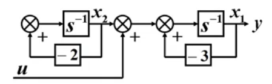
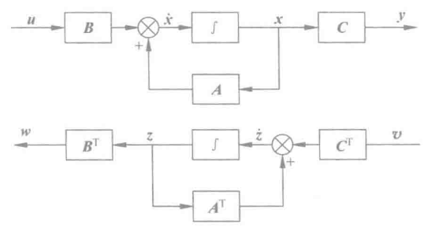

现代控制理论——04 线性系统的能控性和能观测性

<!-- more -->

# 线性系统的能控性和能观测性

## 能控性

能控性的简单理解为输入能够控制系统的状态变量 $x(t)$ 和输出变量 $y(t)$）。

+++info 例子

以下图结构图系统为例，输入 $u$ 只能影响 $x_1$ 而不能影响 $x_2$ ，因此可以说该系统中 $x_2$ 不可控， $x_1$ 可控，系统整体不可控。

{height="100px" width="400px"}

+++


### 线性定常系统的能控性定义

对于线性定常系统： 

$$\dot{x}=Ax+Bu     \tag{1}$$

 如果存在输入控制 $u(t)$ 在有限的时间 $[t_0,t_1]$ 内能将系统从初始状态 $x(t_0)$ 转移到任意的状态 $x(t_1)$ 。

### 线性定常系统的能控性判据

1. 判据1（PHB判据）：对于式（1），系统，该系统完全能控的充要条件为能控性矩阵

$$U_c=\begin{bmatrix}B&AB&\cdots&A^{n-1}B\end{bmatrix}   \tag{2}$$

的秩为 $n$ ，即 $rankU_c =n$。

- 对于线性系统，经过线性非奇异变换后，状态能控性不变。（即能控性与系统有关，与状态变量的选取无关）

```matlab 线性定常系统的能控性判据一示例代码
A = [1,2,1;0,1,0;1,0,3];   % A矩阵必须为n*n矩阵
B = [1,0;0,1;0,0];         % B矩阵必须为n*k矩阵
[n, ~] = size(A);          % 获取状态变量维数
Uc = [B]; temp = B;
for i = 1:n-1
    temp = A*temp;
    Uc = [Uc,temp];    % 能控矩阵
end
disp(rank(Uc)==n);     % 判断状态变量维数是否与能控矩阵的秩一致
```

+++info 例题

;;;id1 例题1

:::info no-icon

考察以下系统的能控性。

$$\begin{bmatrix}\dot{x}_1\\\dot{x}_2\\\dot{x}_3\end{bmatrix}=\begin{bmatrix}1&2&1\\0&1&0\\1&0&3\end{bmatrix}\begin{bmatrix}x_1\\x_2\\x_3\end{bmatrix}+\begin{bmatrix}1&0\\0&1\\0&0\end{bmatrix}\begin{bmatrix}u_1\\u_2\end{bmatrix}$$

:::

由题 $B=\begin{bmatrix}1&0\\0&1\\0&0\end{bmatrix}$， $AB=\begin{bmatrix}1&2&1\\0&1&0\\1&0&3\end{bmatrix}\begin{bmatrix}1&0\\0&1\\0&0\end{bmatrix}=\begin{bmatrix}1&2\\0&1\\1&0\end{bmatrix}$，$A^2B=\begin{bmatrix}1&2&1\\0&1&0\\1&0&3\end{bmatrix}\begin{bmatrix}1&2\\0&1\\1&0\end{bmatrix}=\begin{bmatrix}2&4\\0&1\\4&2\end{bmatrix}$。

故 $U_c=\begin{bmatrix}1&0&1&2&2&4\\0&1&0&1&0&1\\0&0&1&0&4&2\end{bmatrix}$，其秩为3，故该系统可控。

;;;

+++

2. 判据2：对于式（1）系统，若系统矩阵 $A$ 具有互不相同的特征值，则系统状态可控的充要条件是，系统经过线性非奇异变换后，矩阵 $A$ 转换为对角标准型，状态方程为 $\dot{\hat{x}}=\begin{bmatrix}\lambda_1&&0\\&\ddots&\\0&&\lambda_n\end{bmatrix}\hat{x}+\hat{B}u$，其中 $\hat{B}$ 中不含全为0的行。

+++primary 证明（理解）

我们把上述的对角标准型状态方程 $\dot{\hat{x}}=\begin{bmatrix}\lambda_1&&0\\&\ddots&\\0&&\lambda_n\end{bmatrix}\hat{x}+\hat{B}u$ 展开：

$$\left\{ \begin{matrix}\dot{\hat{x}}_1=\lambda_1\hat{x}_1+\hat{b}_{11}u_1+\hat{b}_{12}u_2+\cdots+\hat{b}_{1p}u_p\\\dot{\hat{x}}_2=\lambda_2\hat{x}_2+\hat{b}_{21}u_1+\hat{b}_{22}u_2+\cdots+\hat{b}_{2p}u_p\\\vdots\\\dot{\hat{x}}_n=\lambda_n\hat{x}_n+\hat{b}_{n1}u_1+\hat{b}_{n2}u_2+\cdots+\hat{b}_{np}u_p\\\end{matrix}\right.$$

从中可以看出状态变量间是解耦的，状态变量间是没有联系的。若 $\hat{B}$ 中存在一行全为0，那么该行对应的状态变量将不受输入的控制，故系统不可控。

- 为何要转换为对角标准型：若非对角标准型，状态变量间并不是解耦的，那么输入便可通过状态变量间的耦合关系进行控制。

+++

+++info 例题

;;;id2 例题1

:::info no-icon

判断以下系统的可控性。

$$\begin{bmatrix}\dot{x}_1\\\dot{x}_2\\\dot{x}_3\end{bmatrix}=\begin{bmatrix}3&0&0\\0&-1&0\\0&0&-2\end{bmatrix}\begin{bmatrix}x_1\\x_2\\x_3\end{bmatrix}+\begin{bmatrix}2\\1\\0\end{bmatrix}u$$

:::

该系统不可控，因为状态变量 $x_3$ 不可控。

;;;id2 例题2

:::info no-icon

判断以下系统的可控性。

$$\begin{bmatrix}\dot{x}_1\\\dot{x}_2\\\dot{x}_3\end{bmatrix}=\begin{bmatrix}-7&0&0\\0&-5&0\\0&0&-1\end{bmatrix}\begin{bmatrix}x_1\\x_2\\x_3\end{bmatrix}+\begin{bmatrix}0&1\\4&0\\7&5\end{bmatrix}\begin{bmatrix}u_1\\u_2\end{bmatrix}$$

:::

该系统可控。

;;;

+++

该判据的优点是能够容易判断出能控性，并且能够直接看出不可控的部分，但缺点在于需要等价变换。

注意，上述判据2存在不适用情况：

- 若系统矩阵 $A$ 为对角形但含有相同元素；
- 若系统矩阵 $A$ 的若尔当标准型中有两个若尔当块的特征值相同；

+++info 例子

对于系统 $\dot{x}=\begin{bmatrix}1&0\\0&1\end{bmatrix}x+\begin{bmatrix}1\\1\end{bmatrix}u$，矩阵 $B$ 中虽然没有全零行，但是矩阵 $A$ 为对角阵且含有相同元素，故该系统不可控。

对于系统 $\dot{x}=\begin{bmatrix}-1&1&0\\0&-4&0\\0&0&-4\end{bmatrix}x+\begin{bmatrix}0\\1\\2\end{bmatrix}u$，虽然所有若尔当块的最后一行均没有全零行，但是矩阵 $A$ 为若尔当标准型且存在两个若尔当块的特征值相同，故该系统不可控。

+++

若系统矩阵 $A$ 具有重特征值 $\lambda_1(m_1重),\lambda_2(m_2重),\cdots,\lambda_k(m_k重)$ 且每个重特征值只有一个若尔当块时时，则系统状态可控的充要条件是，系统经过线性非奇异变换后，系统转换为若尔当标准型，状态方程为 $\dot{\hat{x}}=\begin{bmatrix}J_1&0&\cdots&0\\0&J_2&\cdots&0\\\vdots&\vdots&\ddots&\vdots\\0&0&\cdots&J_n\end{bmatrix}\hat{x}+\hat{B}u$，其中 $\hat{B}$ 中与每个若尔当块 $J_i$ 最后一行对应的行中各元素不全为0。

+++info 例题

;;;id3 例题1

:::info no-icon

判断以下系统的可控性。

$$\begin{bmatrix}\dot{x}_1\\\dot{x}_2\\\dot{x}_3\end{bmatrix}=\begin{bmatrix}-3&1&0\\0&-3&0\\0&0&1\end{bmatrix}\begin{bmatrix}x_1\\x_2\\x_3\end{bmatrix}+\begin{bmatrix}0&0\\2&-1\\0&3\end{bmatrix}\begin{bmatrix}u_1\\u_2\end{bmatrix}$$

:::

该系统可控。

;;;id3 例题2

:::info no-icon

判断以下系统的可控性。

$$\begin{bmatrix}\dot{x}_1\\\dot{x}_2\\\dot{x}_3\end{bmatrix}=\begin{bmatrix}4&1&0\\0&4&0\\0&0&-2\end{bmatrix}\begin{bmatrix}x_1\\x_2\\x_3\end{bmatrix}+\begin{bmatrix}4&2\\0&0\\3&0\end{bmatrix}\begin{bmatrix}u_1\\u_2\end{bmatrix}$$

:::

该系统不可控。

+++

### 线性定常系统的输出能控性

很多情况下，被控制量往往是系统的输出而非状态变量，因此还需分析输出能控性。

1. 输出能控性的定义：对于线性定常系统： $\dot{x}=Ax+Bu$， 如果存在输入控制 $u(t)$ 在有限的时间 $[t_0,t_1]$ 内能将系统从初始状态 $y(t_0)$ 转移到任意的状态 $y(t_1)$ ，那么可以说明系统是输出的完全可控。
2. 输出可控性的判据：系统输出完全可控的充要条件是矩阵 $\begin{bmatrix}CB&CAB&CA^2B&\cdots&CA^{n-1}B\end{bmatrix}$ 的秩等于输出的维数，即矩阵 $C$ 的维数。

```matlab 输出可控性示例代码
A = [-4,1;2,-3];   % A矩阵必须为n*n矩阵
B = [1;2];         % B矩阵必须为n*k矩阵
C = [1,0];         % C矩阵必须为p*n矩阵
[n, ~] = size(A);  % 获取状态变量维数
[p, ~] = size(C);  % 获取输出维数
Uc = [C*B]; temp = eye(n,n);
for i = 1:n-1
    temp = temp*A;
    Uc = [Uc,C*temp*B];
end
disp(rank(Uc)==p);
```

+++info 例题

;;;id4 例题1

:::info no-icon

判断以下系统的状态能控性和输出能控性。

$$\begin{matrix}\begin{bmatrix}\dot{x}_1\\\dot{x}_2\end{bmatrix}=\begin{bmatrix}-4&1\\2&-3\end{bmatrix}\begin{bmatrix}x_1\\x_2\end{bmatrix}+\begin{bmatrix}1\\2\end{bmatrix}u\\y=\begin{bmatrix}1&0\end{bmatrix}\begin{bmatrix}x_1\\x_2\end{bmatrix}\end{matrix}$$

:::

系统的状态能控性矩阵：$\begin{bmatrix}B&AB\end{bmatrix}=\begin{bmatrix}1&-2\\2&-4\end{bmatrix}$，秩为1，故系统状态不可控。

系统的输出能控性矩阵：$\begin{bmatrix}CB&CAB\end{bmatrix}=\begin{bmatrix}1&-2\end{bmatrix}$，秩为1，故系统输出可控。

+++

## 能观测性

能观测性是指通过对输出的测量来确定系统的状态变量，反映了从系统外部观测系统内部的能力。

在前面**状态方程的解**方面的内容中，我们知道线性时不变系统动态方程（取初态时间 $t_0=0$）的解为：

$$x(t)=e^{A(t)}x(0)+\int_{0}^te^{A(t-\tau)}Bu(\tau)\,d\tau,  t\geq0   \tag{3}$$

上式中，系统矩阵 $A,B$ 以及控制输入 $u(t)$ 已知，因此只需要关注初态 $x(0)$ 即可得到 $x(t)$。

### 线性定常系统的能观性定义

对于线性定常系统： 

$$\left\{ \begin{aligned}\dot{x}&=Ax+Bu\\y&=Cx   \end{aligned}\right.  \tag{4}$$

 如果在任意给定的输入 $u(t)$ 下，根据输出 $y(t)$ 在有限的时间 $[t_0,t_1]$ 内的测量值唯一确定初始状态 $x(t_0)$ ，则称系统在 $t_0$ 时刻可观测。若在任意时刻都可观测，则该系统是状态完全可观测的。

### 线性定常系统的能观性判据

1. 判据1：对于式（4），系统，该系统完全能控的充要条件为能控性矩阵

$$U_o=\begin{bmatrix}C\\CA\\\vdots\\CA^{n-1}\end{bmatrix}   \tag{5}$$

的秩为 $n$ ，即 $rankU_o =n$。

```matlab 线性定常系统的能观性判据一示例代码
A = [2,-1;1,-3];   % A矩阵必须为n*n矩阵
B = [-1;1];        % B矩阵必须为n*k矩阵
C = [1,0;-1,0];    % C矩阵必须为p*n矩阵
[n, ~] = size(A);  % 获取状态变量维数
[p, ~] = size(C);  % 获取输出维数
Uo = [C]; %temp = eye(n,n);
for i = 1:n-1
    Uo = [Uo;Uo(end-p+1:end,:)*A];
end
disp(rank(Uo)==p);
```

+++info 例题

;;;id5 例题1

:::info no-icon

判断以下系统的能观测性

$$\begin{aligned}\begin{bmatrix}\dot{x_1}\\\dot{x_2}\end{bmatrix}&=\begin{bmatrix}2&-1\\1&-3\end{bmatrix}\begin{bmatrix}x_1\\x_2\end{bmatrix}+\begin{bmatrix}-1\\1\end{bmatrix}u\\\begin{bmatrix}y_1\\y_2\end{bmatrix}&=\begin{bmatrix}1&0\\-1&0\end{bmatrix}\begin{bmatrix}x_1\\x_2\end{bmatrix} \end{aligned}$$

:::

系统的能观性矩阵 $U_o=\begin{bmatrix}C\\CA\\\end{bmatrix}=\begin{bmatrix}1&0\\-1&0\\2&-1\\-2&1\end{bmatrix}$ 的秩为2，故该系统能观测。

+++

2. 判据2：对于式（4）系统，若系统矩阵 $A$ 具有互不相同的特征值，则系统状态可观的充要条件是，系统经过线性非奇异变换后，矩阵 $A$ 转换为对角标准型，状态方程为 $\left\{\begin{aligned}\dot{\hat{x}}&=\begin{bmatrix}\lambda_1&&0\\&\ddots&\\0&&\lambda_n\end{bmatrix}\hat{x}\\y&=\hat{C}\hat{x}\end{aligned}\right.$，其中 $\hat{C}$ 中不含全为0的列。

若系统矩阵 $A$ 具有重特征值 $\lambda_1(m_1重),\lambda_2(m_2重),\cdots,\lambda_k(m_k重)$ 且每个重特征值只有一个若尔当块时时，则系统状态可控的充要条件是，系统经过线性非奇异变换后，系统转换为若尔当标准型，状态方程为 $\left\{\begin{aligned}\dot{\hat{x}}&=\begin{bmatrix}J_1&0&\cdots&0\\0&J_2&\cdots&0\\\vdots&\vdots&\ddots&\vdots\\0&0&\cdots&J_n\end{bmatrix}\hat{x}\\y&=\hat{C}\hat{x}\end{aligned}\right.$，其中 $\hat{C}$ 中与每个若尔当块 $J_i$ 第一列对应的行中各元素不全为0。

+++info 例题

;;;id6 例题1

:::info no-icon

判断以下系统的能观测性

$$\begin{aligned}\dot{x}&=\begin{bmatrix}-2&0\\0&5\end{bmatrix}x\\y&=\begin{bmatrix}1&3\end{bmatrix}x \end{aligned}$$

:::

该系统为对角标准型，不含全为0的列，故系统完全可观测。

;;;id6 例题2

:::info no-icon

判断以下系统的能观测性

$$\begin{aligned}\dot{x}&=\begin{bmatrix}2&1&0&0\\0&2&0&0\\0&0&3&1\\0&0&0&3\end{bmatrix}x\\y&=\begin{bmatrix}0&1&1&0\\0&1&1&1\end{bmatrix}x \end{aligned}$$

:::

该系统为若尔当标准型，第一个若尔当块第一列全为0，故系统不可观测。

;;;id6 例题3

:::info no-icon

判断以下系统的能观测性

$$\begin{aligned}\dot{x}&=\begin{bmatrix}-3&1&0\\0&-3&0\\0&0&1\end{bmatrix}x\\y&=\begin{bmatrix}1&0&0\\0&0&-1\end{bmatrix}x \end{aligned}$$

:::

该系统为若尔当标准型，所有若尔当块的第一列不全为0，故系统可观测。

+++


## 能控性与能观测性的对偶关系

### 对偶系统

对于两个系统 $\Sigma_1:\left\{ \begin{aligned}\dot{x}&=Ax+Bu\\y&=Cx \end{aligned}  \right.$ ， $\Sigma_2:\left\{ \begin{aligned}\dot{z}&=A^Tz+C^Tv\\w&=B^Tz \end{aligned}  \right.$，其中 $x$ 与 $z$ 的维度相同，$u$ 与 $v$ 的维度相同，$y$ 与 $w$ 的维度相同，这两个系统即是对偶系统。

{height="150px"}

### 对偶原理

对于上述两个系统 $\Sigma_1,\Sigma_2$，$\Sigma_1$ 能观 $\Leftrightarrow$ $\Sigma_2$ 能控，$\Sigma_1$ 能控 $\Leftrightarrow$ $\Sigma_2$ 能观。

+++info 证明

证明 $\Sigma_1$ 的能观性矩阵与 $\Sigma_2$ 的能控性矩阵一致， $\Sigma_1$ 的能控性矩阵与 $\Sigma_2$ 的能观性矩阵一致。

+++

:::info no-icon

进一步分析对偶系统的传递函数可知：$G_{\Sigma_1}(s)=[G_{\Sigma_2}(s)]^T$

:::

## 线性定常系统的结构分解

结构分解就是将系统的可控（可观）和不可控（不可观）的部分分离开，进而理解系统的内部。

对于系统 $\left\{ \begin{aligned}\dot{x}&=Ax+Bu\\y&=Cx \end{aligned}   \right.$，以下将进行能控性分解、能观性分解和标准分解。

### 能控性分解

假设系统不完全可控，即能控性矩阵的秩为 $n_1<n$。存在非奇异矩阵 $T_c$ 进行状态变换 $x=T_c\tilde{x}$ ，使得系统的状态空间方程变换为：$\left\{ \begin{aligned}\dot{\tilde{x}}&=\tilde{A}\tilde{x}+\tilde{B}u\\y&=\tilde{C}x \end{aligned}   \right.$，其中 $\tilde{A}=T_c^{-1}AT_c=\begin{bmatrix}\tilde{A}_{11}&\tilde{A}_{12}\\0&\tilde{A}_{22}\end{bmatrix}$，$\tilde{B}=T_c^{-1}B=\begin{bmatrix}\tilde{B}_{1}\\0\end{bmatrix}$，$\tilde{C}=CT_c=\begin{bmatrix}\tilde{C}_{1}&\tilde{C}_2\end{bmatrix}$，其中 $\tilde{A}_{11},\tilde{A}_{12},\tilde{A}_{22}$ 均为分块矩阵，各自的维数为 $n_1\times n_1,n_1\times (n-n_1),(n-n_1)\times (n-n_1)$，$\tilde{B}_{1}$ 为 $n_1\times p$ 的分块矩阵，$\tilde{C}_{1},\tilde{C}_{2}$ 为 $q\times n_1,q\times (n-n_1)$ 的分块矩阵。

那么系统的 $n_1$ 维能控部分可表示为：$\dot{\tilde{x}}=\tilde{A}_{11}\tilde{x}_1+\tilde{A}_{12}\tilde{x}_2+\tilde{B}_1u$，$n-n_1$ 维不可控部分可表示为：$\tilde{x}_2=\tilde{A}_{22}\tilde{x}_2$ 。

那么变换矩阵 $T_c$ 如何获取呢？

+ 从能控性矩阵 $ U_c=\begin{bmatrix}B&AB&\cdots&A^{n-1}B\end{bmatrix}$ 中选取 $n_1$ 个线性无关的列向量作为 $T_c$ 矩阵的前 $n_1$ 列；
+ 其余 $n-n_1$ 列可在保证 $T_c$ 非奇异的条件下任意选取。

+++info 例题

;;;id7 例题1

:::info no-icon

对下列系统进行能控性分解。

$$\begin{aligned}\dot{x}&=\begin{bmatrix}0&0&-1\\1&0&-3\\0&1&-3\end{bmatrix}x+\begin{bmatrix}1\\1\\0\end{bmatrix}u\\y&=\begin{bmatrix}0&1&-2\end{bmatrix}x \end{aligned}$$

:::

+ 计算能控性矩阵的秩。$rank\begin{bmatrix}b&Ab&A^2b\end{bmatrix}=rank\begin{bmatrix}1&0&-1\\1&1&-3\\0&1&-2\end{bmatrix}=2<3$，系统不完全可控。
+ 选取两个线性无关的列向量 $\begin{bmatrix}1\\1\\0\end{bmatrix}$ 和$\begin{bmatrix}0\\1\\1\end{bmatrix}$。再任意选取另外一个线性无关的列向量 $\begin{bmatrix}0\\0\\1\end{bmatrix}$ 构成变换矩阵 $T_c=\begin{bmatrix}1&0&0\\1&1&0\\0&1&1\end{bmatrix}$。
+ 求逆：$T_c^{-1}=\begin{bmatrix}1&0&0\\-1&1&0\\1&-1&1\end{bmatrix}$。
+ 利用状态变换 $x=T_c\tilde{x}$ ，得到变换后的状态空间表达式：$\left\{\begin{aligned}\dot{\tilde{x}}&=\begin{bmatrix}0&-1&-1\\1&-2&-2\\0&0&-1\end{bmatrix}\tilde{x}+\begin{bmatrix}1\\0\\0\end{bmatrix}u\\y&=\begin{bmatrix}1&-1&-2\end{bmatrix}\tilde{x} \end{aligned}\right.$。

故可控部分为：$\left\{\begin{aligned}\dot{\tilde{x}}_1&=\begin{bmatrix}0&-1\\1&-2\end{bmatrix}\tilde{x}_1+\begin{bmatrix}1\\0\end{bmatrix}u\\y&=\begin{bmatrix}1&-1\end{bmatrix}\tilde{x}_1 \end{aligned}\right.$。


+++


### 能观性分解


## 能控标准型和能观测标准型


