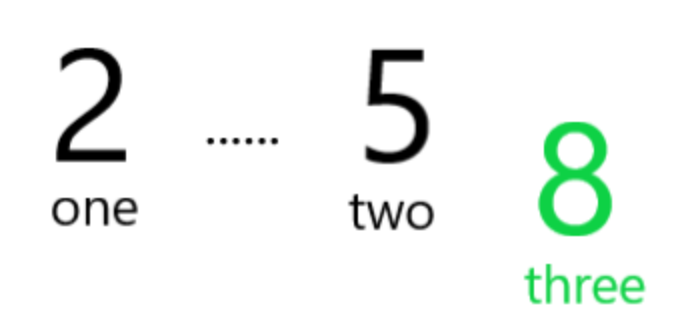

Leetcode刷题记录

<!-- more -->

# Leetcode刷题

## 数组/字符串

### [1071. 字符串的最大公因子](https://leetcode.cn/problems/greatest-common-divisor-of-strings/)

对于字符串 `s` 和 `t`，只有在 `s = t + t + t + ... + t + t`（`t` 自身连接 1 次或多次）时，我们才认定 “`t` 能除尽 `s`”。

给定两个字符串 `str1` 和 `str2` 。返回 *最长字符串 `x`，要求满足 `x` 能除尽 `str1` 且 `x` 能除尽 `str2`* 。

:::info no-icon

若两个字符串是由同一个字符串 X重复拼接而成，那么无论先拼哪个，结果应该相同。
如果 str1 + str2 != str2 +str1，说明不存在公共的重复因子，直接返回空串 ""。
如果两个字符串都是由同一个字符串 X 组成，那么 X 的长度必然是str1.size()和 str2.size() 的最大公约数。

```python
class Solution:
    def gcdOfStrings(self, str1: str, str2: str) -> str:
        if not str1 + str2 == str2 + str1:
            return ""
        return str1[0:self.gcd(len(str1), len(str2))]
    
    def gcd(self, a,b):
        if b == 0: return a
        else: return gcd(b, a%b)
    
```

作者：Random
链接：https://leetcode.cn/problems/greatest-common-divisor-of-strings/solutions/3749891/shu-xue-zui-da-gong-yue-shu-by-coder-ran-a88u/

:::

### [605. 种花问题](https://leetcode.cn/problems/can-place-flowers/)

假设有一个很长的花坛，一部分地块种植了花，另一部分却没有。可是，花不能种植在相邻的地块上，它们会争夺水源，两者都会死去。

给你一个整数数组 `flowerbed` 表示花坛，由若干 `0` 和 `1` 组成，其中 `0` 表示没种植花，`1` 表示种植了花。另有一个数 `n` ，能否在不打破种植规则的情况下种入 `n` 朵花？能则返回 `true` ，不能则返回 `false` 。

:::info no-icon

从左到右遍历数组，能种花就立刻种花。

如何判断能否种花？由于「花不能种植在相邻的地块上」，如果要在下标 i 处种花，需要满足 flowerbed[i−1],flowerbed[i],flowerbed[i+1] 均为 0。

每种一朵花，就把 n 减一。如果最后 n≤0，则返回 true，否则返回 false。

为了简化判断逻辑，可以在数组的开头和末尾各插入一个 0。

```python
class Solution:
    def canPlaceFlowers(self, flowerbed: List[int], n: int) -> bool:
      nums = len(flowerbed)
      new_flowerbed = [0] + flowerbed + [0]
      for i in range(1,len(new_flowerbed)-1):
        if new_flowerbed[i-1] == 0 and new_flowerbed[i+1] == 0 and new_flowerbed[i] == 0:
          new_flowerbed[i] = 1
          n -= 1
      return n <= 0

```

作者：灵茶山艾府
链接：https://leetcode.cn/problems/can-place-flowers/solutions/2463018/ben-ti-zui-jian-dan-xie-fa-pythonjavacgo-6a6k/

:::

### [334. 递增的三元子序列](https://leetcode.cn/problems/increasing-triplet-subsequence/)

给你一个整数数组 `nums` ，判断这个数组中是否存在长度为 `3` 的递增子序列。

如果存在这样的三元组下标 `(i, j, k)` 且满足 `i < j < k` ，使得 `nums[i] < nums[j] < nums[k]` ，返回 `true` ；否则，返回 `false` 。

:::info no-icon

;;;id1 巧解

核心想法：遍历一遍数组，希望遍历到的这个数three，前面已经有一个比他小的数two，再前面有一个比two小的数one。
我们需要维护两个变量：one和two。代表递增子序列的第一个数和第二个数。
假设我们已经有了这两个数，那么three的大小有以下三种情况：

1. **three大于two**    此情况下：即找到了三元组，直接返回true。

   

2. **three介于two和one之间**     此情况下：应更新two，赋值为这个更小的值。这相当于帮我们扩大了three的可选择范围，当再次遇到一个比更新过的two大的数即可找到。

   

   

3. **three小于one**     此情况下：应更新one，赋值为这个更小的值。而不需要动two。这相当于帮我们扩大了之后出现的two的可选择范围。进而扩大了之后出现的three的可选择范围。


需要注意的是，我们只更新one，原先的two不需要更改，因为子序列是从前往后的，只有当之后再出现比two小的数的时候再按照第二步那样更改。

假设有如下示例：[2,5,1,6]，在遇到1之后更新了one，后遇到6，因为先判断是否大于two，由于6大于5，就直接返回true了。


注意：two附带隐含信息——这之前有个数比two小
所以此时找到的递增子序列不是one、two、three的1 5 6，而是old one、two、three的2 5 6。

这里更新的one的意思是，为之后可能存在的更小的递增子序列打基础。
假设有如下示例：[2,5,1,2,6]，在遇到1之后更新了one，后遇到2，2介于1和5（two）之间，更新two为2，后遇到6，由于6大于2，返回true。
此时找到的递增子序列才是one、two、three的1 2 6

最后考虑one、two的初值，容易想到设定为Integer.MAX_VALUE即可。

作者：Xzz
链接：https://leetcode.cn/problems/increasing-triplet-subsequence/solutions/535725/pou-xi-ben-zhi-yi-wen-bang-ni-kan-qing-t-3ye2/

```python
class Solution:
    def increasingTriplet(self, nums: List[int]) -> bool:
      one, two = inf, inf
      for three in nums:
        if three > two : return True
        elif three <= one: one = three
        else: two = three
      return False
```


+++info 解析（GPT）

 **1. 递增三元组的性质**

假设数组中存在递增三元组 `a < b < c`，它们的顺序在数组中是 **前后顺序**，我们只关心：

- 第一个数最小
- 第二个数比第一个数大
- 第三个数比第二个数大

**关键点**：我们不需要知道三元组具体位置，只需要保证存在。

 **2. one 和 two 的作用**

- `one`：当前找到的**最小的候选第一个数**
- `two`：在 `one` 之后，找到的**最小的候选第二个数**

**核心思想**：

- 我们并不是在找数组中所有可能的三元组，而是在**维护最优候选序列**。
- “最优候选”意味着 **尽可能小的 one 和 two**，这样可以最大化出现第三个数 three 的机会。

换句话说：

1. 遍历到一个数 three：
   - 如果 three > two → 说明找到了一个合法三元组（不管前面 one/two 是不是更新过的，都会形成合法的递增序列）。
2. 如果 three <= one → 更新 one
   - 因为这个更小的 one 可以为之后出现的 two 提供更多可能。
3. 否则 → 更新 two
   - 因为这个更小的 two 可以为之后出现的 three 提供更多可能。

 **3. 为什么不会漏掉任何情况**

假设数组中有递增三元组 `x < y < z`，为什么算法一定能找到它？

- 当我们遍历到 x：
  - one 会被更新为 ≤ x
- 当我们遍历到 y：
  - two 会被更新为 ≤ y
- 当我们遍历到 z：
  - 如果 z > two → 返回 True

**关键点**：

- 即使 one/two 被后面更小的数更新过，**old one/two 仍然保留了前序信息**，保证当前 three 大于某个二元组时，必然能形成递增三元组。
- 换句话说，one/two 是动态维护的 **最小可能序列候选**，任何真正存在的递增三元组都会被捕获。


;;;

;;;id1 常规

常规解法

;;;

:::


## 滑动窗口

### [1208. 尽可能使字符串相等](https://leetcode.cn/problems/get-equal-substrings-within-budget/)

给你两个长度相同的字符串，`s` 和 `t`。

将 `s` 中的第 `i` 个字符变到 `t` 中的第 `i` 个字符需要 `|s[i] - t[i]|` 的开销（开销可能为 0），也就是两个字符的 ASCII 码值的差的绝对值。

用于变更字符串的最大预算是 `maxCost`。在转化字符串时，总开销应当小于等于该预算，这也意味着字符串的转化可能是不完全的。

如果你可以将 `s` 的子字符串转化为它在 `t` 中对应的子字符串，则返回可以转化的最大长度。

如果 `s` 中没有子字符串可以转化成 `t` 中对应的子字符串，则返回 `0`。

+++info 示例

**示例 1：**

```
输入：s = "abcd", t = "bcdf", maxCost = 3
输出：3
解释：s 中的 "abc" 可以变为 "bcd"。开销为 3，所以最大长度为 3。
```

**示例 2：**

```
输入：s = "abcd", t = "cdef", maxCost = 3
输出：1
解释：s 中的任一字符要想变成 t 中对应的字符，其开销都是 2。因此，最大长度为 1。
```

**示例 3：**

```
输入：s = "abcd", t = "acde", maxCost = 0
输出：1
解释：a -> a, cost = 0，字符串未发生变化，所以最大长度为 1。
```

+++

:::info no-icon

两个长度相等字符串的 s 和 t ，把 i 位置的 s[i] 转成 t[i] 的开销是两者 ASCII 码之差的绝对值。题目给出了允许的最大预算 maxCost ，求不超过预算的情况下能够转换的最长子串。

比如，对于 s = "abcd", t = "bcdf", cost = 3 而言，我们使用 costs[i] 表示从 s[i]  转成 t[i] 的开销，那么 costs = [1, 1, 1, 2] 。由于 maxCost = 3， 所以最多允许其前面三个字符进行转换。

于是题目变成了：**已知一个数组 costs ，求：和不超过 maxCost 时最长的子数组的长度**。


```python
class Solution:
    def equalSubstring(self, s: str, t: str, maxCost: int) -> int:
        n = len(s)
        left, right = 0, 0
        result = 0
        cost = 0
        while right < n:
            cost += abs(ord(s[right]) - ord(t[right]))
            while cost > maxCost:
                cost -= abs(ord(s[left]) - ord(t[left]))
                left += 1
                
            result = max(result, right - left + 1)
            right += 1
        return result

```


《挑战程序设计竞赛》这本书中把滑动窗口叫做「虫取法」，我觉得非常生动形象。因为滑动窗口的两个指针移动的过程和虫子爬动的过程非常像：前脚不动，把后脚移动过来；后脚不动，把前脚向前移动。

+++info 滑动窗口问题模板

我分享一个滑动窗口的模板，能解决大多数的滑动窗口问题（[1004. 最大连续1的个数 III](https://leetcode.cn/problems/max-consecutive-ones-iii/)，[424. 替换后的最长重复字符](https://leetcode.cn/problems/longest-repeating-character-replacement/)）：

```python
def findSubArray(nums):
    N = len(nums) # 数组/字符串长度
    left, right = 0, 0 # 双指针，表示当前遍历的区间[left, right]，闭区间
    sums = 0 # 用于统计 子数组/子区间 是否有效，根据题目可能会改成求和/计数
    res = 0 # 保存最大的满足题目要求的 子数组/子串 长度
    while right < N: # 当右边的指针没有搜索到 数组/字符串 的结尾
        sums += nums[right] # 增加当前右边指针的数字/字符的求和/计数
        while 区间[left, right]不符合题意：# 此时需要一直移动左指针，直至找到一个符合题意的区间
            sums -= nums[left] # 移动左指针前需要从counter中减少left位置字符的求和/计数
            left += 1 # 真正的移动左指针，注意不能跟上面一行代码写反
        # 到 while 结束时，我们找到了一个符合题意要求的 子数组/子串
        res = max(res, right - left + 1) # 需要更新结果
        right += 1 # 移动右指针，去探索新的区间
    return res
```

滑动窗口中用到了左右两个指针，它们移动的思路是：以右指针作为驱动，拖着左指针向前走。右指针每次只移动一步，而左指针在内部 while 循环中每次可能移动多步。右指针是主动前移，探索未知的新区域；左指针是被迫移动，负责寻找满足题意的区间。

模板的整体思想是：

定义两个指针 left 和 right 分别指向区间的开头和结尾，注意是闭区间；定义 sums 用来统计该区间内的各个字符出现次数；
第一重 while 循环是为了判断 right 指针的位置是否超出了数组边界；当 right 每次到了新位置，需要增加 right 指针的求和/计数；
第二重 while 循环是让 left 指针向右移动到 [left, right] 区间符合题意的位置；当 left 每次移动到了新位置，需要减少 left 指针的求和/计数；
在第二重 while 循环之后，成功找到了一个符合题意的 [left, right] 区间，题目要求最大的区间长度，因此更新 res 为 max(res, 当前区间的长度) 。
right 指针每次向右移动一步，开始探索新的区间。
模板中的 sums 需要根据题目意思具体去修改，本题是求和题目因此把sums 定义成整数用于求和；如果是计数题目，就需要改成字典用于计数。当左右指针发生变化的时候，都需要更新 sums 。

另外一个需要根据题目去修改的是内层 while 循环的判断条件，即： 区间[left, right]不符合题意 。对于本题而言，就是该区内的和 sums 超过了 maxCost 。

+++


作者：负雪明烛
链接：https://leetcode.cn/problems/get-equal-substrings-within-budget/solutions/592354/fen-xiang-zhen-cang-de-hua-dong-chuang-k-e3rd/
:::


### [424. 替换后的最长重复字符](https://leetcode.cn/problems/longest-repeating-character-replacement/)

给你一个字符串 `s` 和一个整数 `k` 。你可以选择字符串中的任一字符，并将其更改为任何其他大写英文字符。该操作最多可执行 `k` 次。

在执行上述操作后，返回 *包含相同字母的最长子字符串的长度。*

+++info 示例

**示例 1：**

```
输入：s = "ABAB", k = 2
输出：4
解释：用两个'A'替换为两个'B',反之亦然。
```

**示例 2：**

```
输入：s = "AABABBA", k = 1
输出：4
解释：
将中间的一个'A'替换为'B',字符串变为 "AABBBBA"。
子串 "BBBB" 有最长重复字母, 答案为 4。
可能存在其他的方法来得到同样的结果。
```

+++

:::info no-icon

本题解根据常规的滑动窗口思路进行解题，不需要任何的技巧。
滑动窗口法是指通过Left以及Right指针来框定一个窗口，当在窗口内的字符串满足题目要求则记录下当前窗口长度并进一步扩张寻找更长的窗口，若不满足则进行窗口平移。
题目中给定的K值是让我们在选定有效窗口时的要求放宽了：

当K=0时，要求滑动窗口内部的所有字母都必须相同；
而当K>0时，要求滑动窗口内最多替换K次使得所有字母都必须相同。这里有一个关键点，即我们将当前滑动窗口内出现次数最多的字母作为基准字母（Benchmark），那么其他不一样的字母(Others)都选择替换操作即可以最小的代价转换为全部相同的字母。
因此，我们首先通过一个数组(count)记录所有字母在当前窗口出现的次数，通过Max函数选择窗口内的基准字母，然后其他字母出现的次数为Sum(count)-Max(count)，通过与K进行比较，即可知道当前窗口是否有效，下一步是继续扩张还是位移。

```python
class Solution:
    def characterReplacement(self, s: str, k: int) -> int:
        count = [0 for _ in range(26)]  #记录当前窗口的字母出现次数
        
        left = 0    #滑动窗口左边界
        right = 0   #滑动窗口右边界
        retval = 0  #最长窗口长度
        
        while right < len(s):
            count[ord(s[right])-ord('A')] += 1  
            benchmark = max(count)              #选择出现次数最多的字母为基准 
            others = sum(count) - benchmark     #则其他字母需要通过替换操作来变为基准
            if others <= k:                     #通过与K进行比较来判断窗口是进行扩张？
                right += 1
                retval = max(retval, right-left)#记录当前有效窗口长度
            else:                               #通过与K进行比较来判断窗口还是进行位移？
                count[ord(s[left])-ord('A')] -= 1
                left += 1
                right += 1                      #这里注意：位移操作需要整个向右移，不仅仅只是left向右
        
        return retval                           #返回最长窗口长度
        
```

作者：Derrick.S
链接：https://leetcode.cn/problems/longest-repeating-character-replacement/solutions/799013/hua-dong-chuang-kou-fa-jian-dan-yi-dong-3qwel/

:::

## 前缀和

### [724. 寻找数组的中心下标](https://leetcode.cn/problems/find-pivot-index/)

给你一个整数数组 `nums` ，请计算数组的 **中心下标** 。

数组 **中心下标** 是数组的一个下标，其左侧所有元素相加的和等于右侧所有元素相加的和。

如果中心下标位于数组最左端，那么左侧数之和视为 `0` ，因为在下标的左侧不存在元素。这一点对于中心下标位于数组最右端同样适用。

如果数组有多个中心下标，应该返回 **最靠近左边** 的那一个。如果数组不存在中心下标，返回 `-1` 。

+++info 示例

**示例 1：**

```
输入：nums = [1, 7, 3, 6, 5, 6]
输出：3
解释：
中心下标是 3 。
左侧数之和 sum = nums[0] + nums[1] + nums[2] = 1 + 7 + 3 = 11 ，
右侧数之和 sum = nums[4] + nums[5] = 5 + 6 = 11 ，二者相等。
```

**示例 2：**

```
输入：nums = [1, 2, 3]
输出：-1
解释：
数组中不存在满足此条件的中心下标。
```

**示例 3：**

```
输入：nums = [2, 1, -1]
输出：0
解释：
中心下标是 0 。
左侧数之和 sum = 0 ，（下标 0 左侧不存在元素），
右侧数之和 sum = nums[1] + nums[2] = 1 + -1 = 0 。
```

+++

:::info no-icon

设 nums 的元素之和为 s。

设中心下标为 i，其左侧元素和为 $leftS=nums[0]+nums[1]+⋯+nums[i−1]$，那么右侧元素和为 $s−nums[i]−leftS$。

由于左侧元素和等于右侧元素和，所以有

$$leftS=s−nums[i]−leftS$$
即

$$2⋅leftS=s−nums[i]$$
从左到右遍历数组，一边遍历，一边累加元素更新 leftS。每次累加前，检查是否满足上式，满足则返回 i。

如果不存在这样的 i，返回 −1。

```python
class Solution:
    def pivotIndex(self, nums: List[int]) -> int:
        s = sum(nums)
        sum_left = 0
        for i, num in enumerate(nums):
            if 2*sum_left == s - num:
                return i
            sum_left += num
        return -1
```

作者：灵茶山艾府
链接：https://leetcode.cn/problems/find-pivot-index/solutions/2834687/jian-ji-xie-fa-o1-e-wai-kong-jian-python-tz0p/

:::

### [2352. 相等行列对](https://leetcode.cn/problems/equal-row-and-column-pairs/)

给你一个下标从 **0** 开始、大小为 `n x n` 的整数矩阵 `grid` ，返回满足 `Ri` 行和 `Cj` 列相等的行列对 `(Ri, Cj)` 的数目*。*

如果行和列以相同的顺序包含相同的元素（即相等的数组），则认为二者是相等的。

::: info no-icon

用哈希表统计每行出现的次数，然后遍历列，累加哈希表中列出现的次数。


作者：灵茶山艾府
链接：https://leetcode.cn/problems/equal-row-and-column-pairs/solutions/1694047/ha-xi-biao-python-liang-xing-by-endlessc-ljae/

;;;id2 Demo 1

```python
class Solution:
    def equalPairs(self, grid: List[List[int]]) -> int:
        cnt = Counter(tuple(row) for row in grid)
        return sum(cnt[col] for col in zip(*grid))

```

;;;

;;;id2 Demo2

```python
class Solution:
    def equalPairs(self, grid: List[List[int]]) -> int:
        n = len(grid)
        count = {}
        result = 0
        for i in range(n):
            count[tuple(grid[i])] = count.get(tuple(grid[i]), 0) + 1
        print(count)
        for j in zip(*grid):
            print(j)
            result += count.get(j,0)
            # print(grid[:][j], grid[j][:])
        return result
```

;;;

:::

## 栈与队列

### [735. 小行星碰撞](https://leetcode.cn/problems/asteroid-collision/)

给定一个整数数组 `asteroids`，表示在同一行的小行星。数组中小行星的索引表示它们在空间中的相对位置。

对于数组中的每一个元素，其绝对值表示小行星的大小，正负表示小行星的移动方向（正表示向右移动，负表示向左移动）。每一颗小行星以相同的速度移动。

找出碰撞后剩下的所有小行星。碰撞规则：两个小行星相互碰撞，较小的小行星会爆炸。如果两颗小行星大小相同，则两颗小行星都会爆炸。两颗移动方向相同的小行星，永远不会发生碰撞。

+++info 示例

**示例 1：**

```
输入：asteroids = [5,10,-5]
输出：[5,10]
解释：10 和 -5 碰撞后只剩下 10 。 5 和 10 永远不会发生碰撞。
```

**示例 2：**

```
输入：asteroids = [8,-8]
输出：[]
解释：8 和 -8 碰撞后，两者都发生爆炸。
```

**示例 3：**

```
输入：asteroids = [10,2,-5]
输出：[10]
解释：2 和 -5 发生碰撞后剩下 -5 。10 和 -5 发生碰撞后剩下 10 。
```

+++

:::info no-icon

这道栈的题目难点应该主要是在分析场景上了。
我们需要明确什么时候无脑入栈，什么时候需要判断，理解这两点就可以轻松解题了。
首先，循环每一个元素时，在什么情况下无脑入栈呢？

栈为空
栈顶元素为负数(下一个为负数则一起向左，下一个为正数则分向两边)
当前元素为正数（栈顶为正一起向右，栈顶为负分向两边）
下来，我们需要看碰撞的场景又细分为什么情况：

栈顶元素大于abs(当前元素)，当前元素被撞毁
栈顶元素等于abs(当前元素)，栈顶弹出和当前元素抵消
栈顶元素小于abs(当前元素)，栈顶弹出，并与新栈顶完成上述判断
最终返回栈即可。

```python
class Solution:
    def asteroidCollision(self, asteroids: List[int]) -> List[int]:
        stack, index = [], 0
        while index < len(asteroids):
            ast = asteroids[index]
            if ast > 0 or len(stack)==0 or stack[-1]<0: stack.append(ast)
            elif stack[-1] <= - ast:
                if stack.pop(-1) < - ast:
                    continue
            index += 1
        return stack
```

作者：清风Python
链接：https://leetcode.cn/problems/asteroid-collision/solutions/994100/735xing-xing-peng-zhuang-ji-yu-zhan-qu-f-xpd1/

:::

### [394. 字符串解码](https://leetcode.cn/problems/decode-string/)

给定一个经过编码的字符串，返回它解码后的字符串。

编码规则为: `k[encoded_string]`，表示其中方括号内部的 `encoded_string` 正好重复 `k` 次。注意 `k` 保证为正整数。

你可以认为输入字符串总是有效的；输入字符串中没有额外的空格，且输入的方括号总是符合格式要求的。

此外，你可以认为原始数据不包含数字，所有的数字只表示重复的次数 `k` ，例如不会出现像 `3a` 或 `2[4]` 的输入。

测试用例保证输出的长度不会超过 `105`。

+++info 示例

**示例 1：**

```
输入：s = "3[a]2[bc]"
输出："aaabcbc"
```

**示例 2：**

```
输入：s = "3[a2[c]]"
输出："accaccacc"
```

**示例 3：**

```
输入：s = "2[abc]3[cd]ef"
输出："abcabccdcdcdef"
```

**示例 4：**

```
输入：s = "abc3[cd]xyz"
输出："abccdcdcdxyz"
```

+++

:::info no-icon

+ 本题难点在于括号内嵌套括号，需要从内向外生成与拼接字符串，这与栈的先入后出特性对应。

+ 算法流程：

  + 构建辅助栈 stack， 遍历字符串 s 中每个字符 c；

    + 当 c 为数字时，将数字字符转化为数字 multi，用于后续倍数计算；

    + 当 c 为字母时，在 res 尾部添加 c；

    + 当 c 为 [ 时，将当前 multi 和 res 入栈，并分别置空置 0：
      记录此 [ 前的临时结果 res 至栈，用于发现对应 ] 后的拼接操作；
      记录此 [ 前的倍数 multi 至栈，用于发现对应 ] 后，获取 multi × [...] 字符串。
      进入到新 [ 后，res 和 multi 重新记录。

    + 当 c 为 ] 时，stack 出栈，拼接字符串 res = last_res + cur_multi * res，其中:
      + last_res是上个 [ 到当前 [ 的字符串，例如 "3[a2[c]]" 中的 a；
      + cur_multi是当前 [ 到 ] 内字符串的重复倍数，例如 "3[a2[c]]" 中的 2。

  + 返回字符串 res。

```python
class Solution:
    def decodeString(self, s: str) -> str:
        result = ''
        stack = []
        res, num = '', 0
        for c in s:
            if c == '[':
                stack.append((res, num))
                res, num = '', 0
            elif c == ']':
                out_res, out_num = stack.pop()
                res = out_res + out_num*res
            elif '0'<= c <= '9':
                num = num*10 + int(c)
            else:
                res += c
        return res
```

作者：Krahets
链接：https://leetcode.cn/problems/decode-string/solutions/19447/decode-string-fu-zhu-zhan-fa-di-gui-fa-by-jyd/

:::

### [649. Dota2 参议院](https://leetcode.cn/problems/dota2-senate/)

Dota2 的世界里有两个阵营：`Radiant`（天辉）和 `Dire`（夜魇）

Dota2 参议院由来自两派的参议员组成。现在参议院希望对一个 Dota2 游戏里的改变作出决定。他们以一个基于轮为过程的投票进行。在每一轮中，每一位参议员都可以行使两项权利中的 **一** 项：

- **禁止一名参议员的权利**：参议员可以让另一位参议员在这一轮和随后的几轮中丧失 **所有的权利** 。
- **宣布胜利**：如果参议员发现有权利投票的参议员都是 **同一个阵营的** ，他可以宣布胜利并决定在游戏中的有关变化。

给你一个字符串 `senate` 代表每个参议员的阵营。字母 `'R'` 和 `'D'`分别代表了 `Radiant`（天辉）和 `Dire`（夜魇）。然后，如果有 `n` 个参议员，给定字符串的大小将是 `n`。

以轮为基础的过程从给定顺序的第一个参议员开始到最后一个参议员结束。这一过程将持续到投票结束。所有失去权利的参议员将在过程中被跳过。

假设每一位参议员都足够聪明，会为自己的政党做出最好的策略，你需要预测哪一方最终会宣布胜利并在 Dota2 游戏中决定改变。输出应该是 `"Radiant"` 或 `"Dire"` 。

+++info 示例

**示例 1：**

```
输入：senate = "RD"
输出："Radiant"
解释：
第 1 轮时，第一个参议员来自 Radiant 阵营，他可以使用第一项权利让第二个参议员失去所有权利。
这一轮中，第二个参议员将会被跳过，因为他的权利被禁止了。
第 2 轮时，第一个参议员可以宣布胜利，因为他是唯一一个有投票权的人。
```

**示例 2：**

```
输入：senate = "RDD"
输出："Dire"
解释：
第 1 轮时，第一个来自 Radiant 阵营的参议员可以使用第一项权利禁止第二个参议员的权利。
这一轮中，第二个来自 Dire 阵营的参议员会将被跳过，因为他的权利被禁止了。
这一轮中，第三个来自 Dire 阵营的参议员可以使用他的第一项权利禁止第一个参议员的权利。
因此在第二轮只剩下第三个参议员拥有投票的权利,于是他可以宣布胜利
```

+++

:::info no-icon

这道题模拟了一个游戏过程，最终当有权利投票的参议员都是 同一个阵营的 ，这个阵营即获胜。

那么两个阵营的每个参议员为了获胜，当他拥有权力的时候，一定是会将自己之后首个对立阵营的参议员的权力禁止掉。【这就是每一位参议会为自己的政党做出最好的策略】。请注意：当之后没有对立阵营的参议员的时候，相当于将之前的参议员加到其之后。


```python
class Solution:
    def predictPartyVictory(self, senate: str) -> str:
        radiants, dires = [], []
        n = len(senate)
        for i, se in enumerate(senate):
            if se == 'R': radiants.append(i)
            else: dires.append(i)
        while radiants and dires:
            if radiants[0] < dires[0]:
                dires.pop(0)
                radiants.append(radiants.pop(0) + n)
            else:
                radiants.pop(0)
                dires.append(dires.pop(0) + n)
        return "Radiant" if radiants else 'Dire'
        
```


作者：画图小匠
链接：https://leetcode.cn/problems/dota2-senate/solutions/2862115/javapython3cdui-lie-mo-ni-jin-zhi-zhi-ho-l4pb/

:::

## 链表

:::info no-icon

1. 找中间节点：快慢指针

+ 中间值左侧：需要加一个dummy节点。

  ```python
  dummy = ListNode(0, head)
  slow, fast = dummy, dummy
  while fast and fast.next:
      fast = fast.next.next
      if not fast: break
      slow = slow.next
  ```

+ 中间值右侧：直接从head开始

  ```python
  slow, fast = head, head
  while fast and fast.next:
      fast = fast.next.next
      if not fast: break
      slow = slow.next
  ```

  

:::


